# Summary
Demonstration for a Machine Control Solution on Exosite Murano IoT Platform using ST Micro STM32F746G Discovery Kit

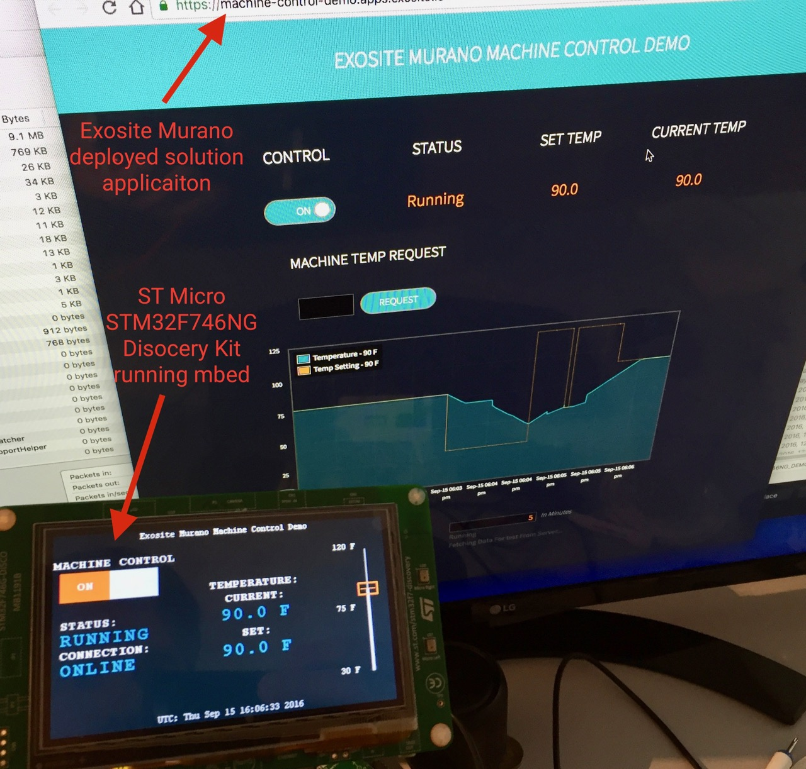

*Note that this is an early demo and little testing or documentation is provided.  
I apologize for this and am working on that.*

# Hardware
* [ST Micro STM32F746G Discovery Kit](http://www.st.com/content/st_com/en/products/evaluation-tools/product-evaluation-tools/mcu-eval-tools/stm32-mcu-eval-tools/stm32-mcu-discovery-kits/32f746gdiscovery.html?icmp=pf261641_pron_pr-massmarket_jun2015&sc=stm32f7discovery-pr)
* Firmware: [mbed - Demo Application](https://developer.mbed.org/users/maanenson/code/EXOSITE_DISCO-F746NG_MACHINE_DEMO/)

*Note: Demo firmware application uses device's MAC Address as unique identifier to activate with the system.*

*Note: Make sure to change the Product ID definition when compiling for your board and your Murano Product.*

# Assumptions
- You have the hardware described above along with USB Cable (Power and connection to your computer) and Ethernet cable with active internet connection (to communicate with Exosite's Murano platform).  

- You have an account on https://developer.mbed.org/ and have some knowledge for how to use it to compile downloads for your board.  The Discovery development kit comes pre-loaded with a bootloader that works with mbed.

- You have an Exosite Murano account or will create one. https://exosite.io/

# Quick Start Guide

1. Connect the Discovery dev kit to your computer with the USB Cable.  This should show up as a Mass Storage device on  your computer (Like a USB Thumb Drive).  

2. Connect the dev kit to an active internet connection using an Ethernet cable.

3. Import the demo application
  [found here](https://developer.mbed.org/users/maanenson/code/EXOSITE_DISCO-F746NG_MACHINE_DEMO/) by either click on the 'Import into Compiler' button on the right side or clicking this [link](https://developer.mbed.org/compiler/#import:/users/maanenson/code/EXOSITE_DISCO-F746NG_MACHINE_DEMO/)

  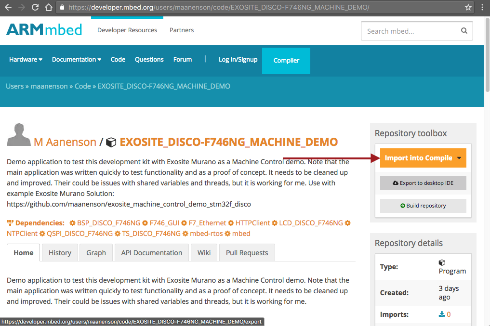

4. In the Compiler IDE window, you should see a program called "EXOSITE_DISCO-F746NG_MACHINE_DEMO" now.  Click on main.cpp, which is the main application file.

  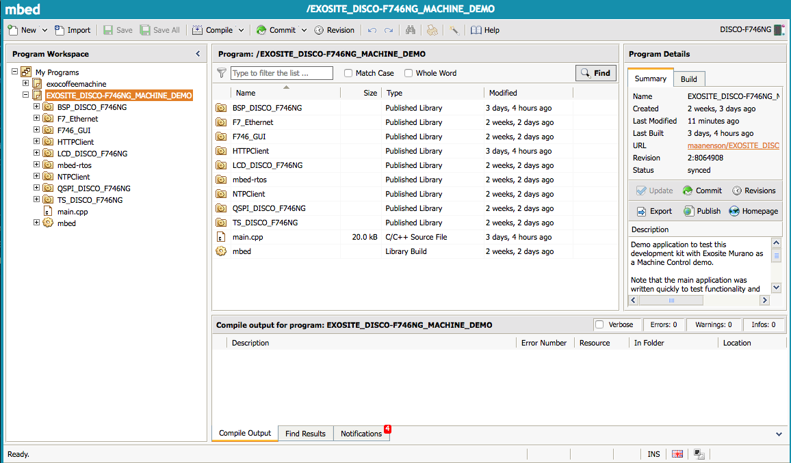

5. Create a new Product in your Murano account. (Create a new account if you do not have one already) https://www.exosite.io/business/products

  - Select 'Start from scratch' option and use the following link for your template: https://raw.githubusercontent.com/maanenson/exosite_machine_control_demo_stm32f_disco/master/product/product_spec_template.yaml

    **IMPORTANT NOTE: Using this template file to create the definition for a product does not  work correctly.  A bug has been submitted with Murano R&D team.  Have to create the defintion from scratch in the mean-time.**
    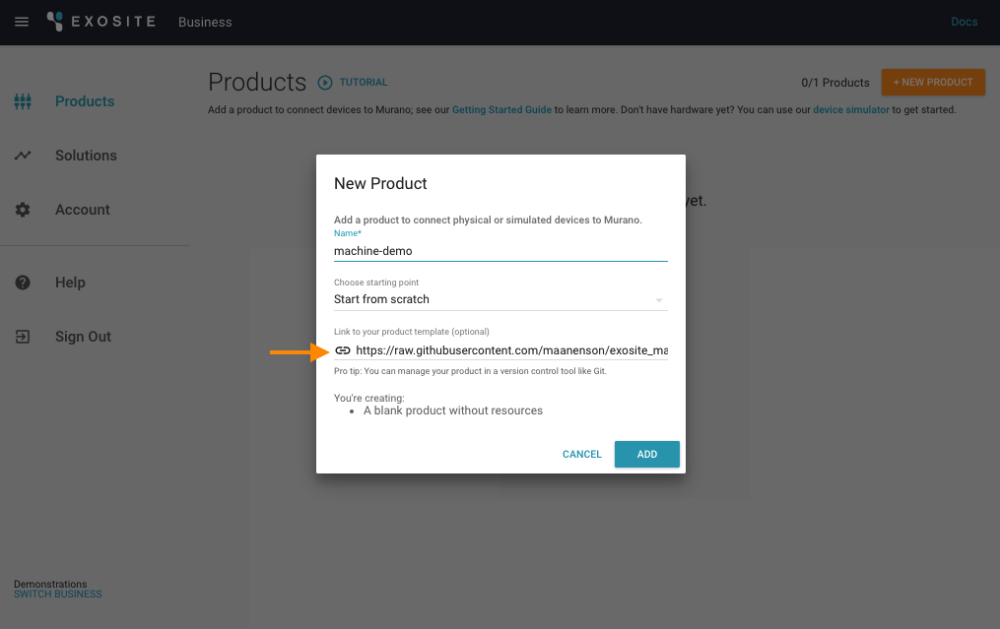

    Your Product Definition should look like the following after Adding your product.
    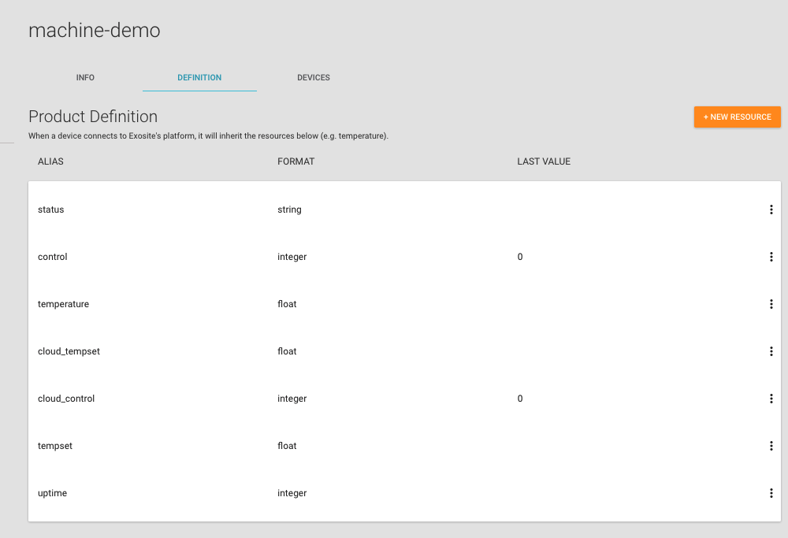

6. Back in the mbed Compiler window, in your main.cpp file, edit the line containing the definition for your Product ID.  This is the Product Model ID that the device will attempt to activate using and is tied to your Murano account Product.
  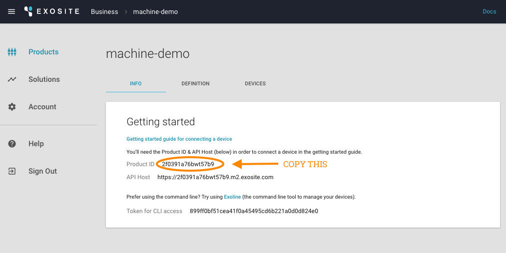

  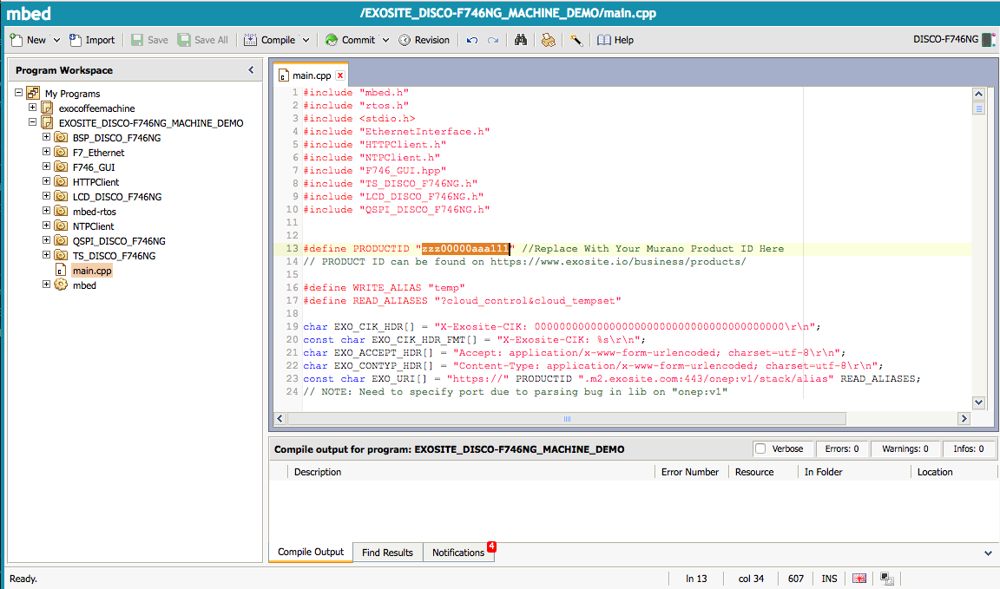

7. Next, hit the 'Compile' button in the mbed compiler IDE.  After completion, a .bin file should be downloaded in your browser.

  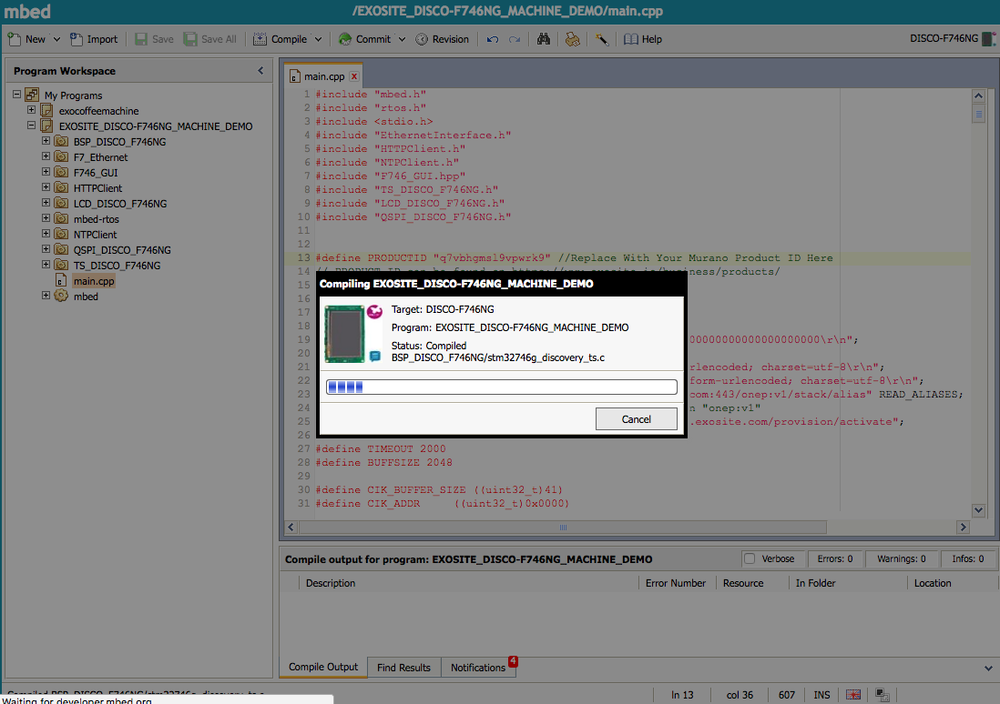

8. Copy the .bin file to the Mass Storage drive folder that shows up when you plug the kit into your computer via USB cable.  The bootloader should detect the new binary file, update itself, and reboot.  

  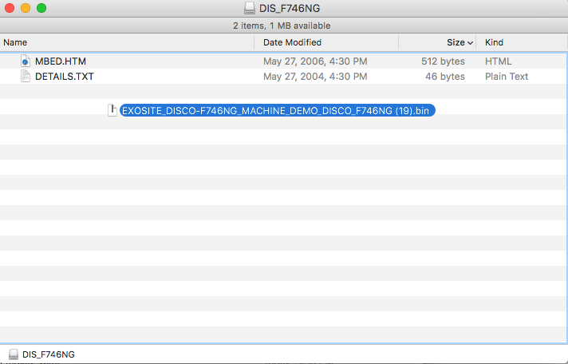

  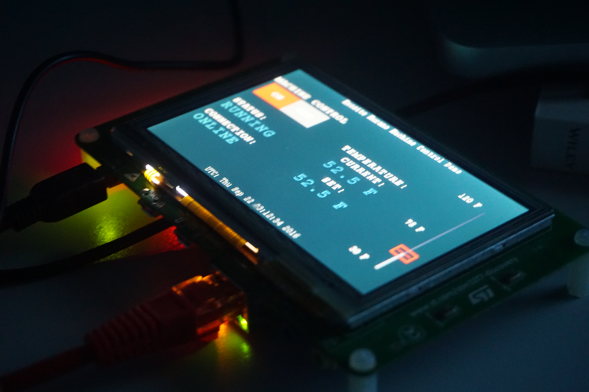

9. We now need to add your specific unique device to your product model so it can activate.     
  *(Note that if you previously activated it under another Product Model, it may find it's previous CIK in memory and use that.)*
  Using a Serial Terminal application (e.g. TeraTerm on Windows, CoolTerm on Mac), connect to the virtual serial port (over USB).  (Settings: 9600 baud)
  Reset the board, you'll see the MAC address printed out.

  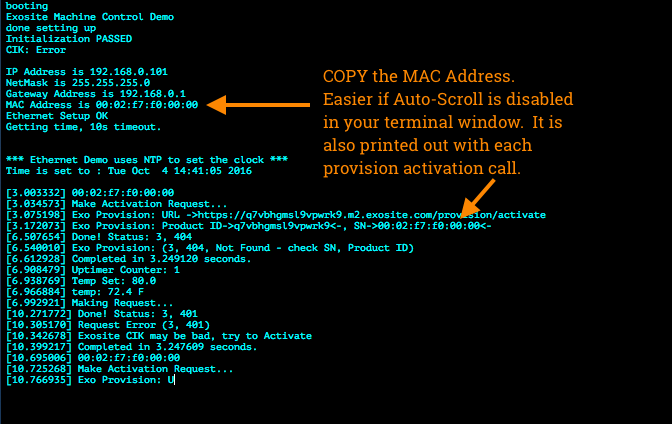

10. After retrieving your MAC address, go to the Murano Product page and click on the Devices tab.  Add a new device using your MAC address.

  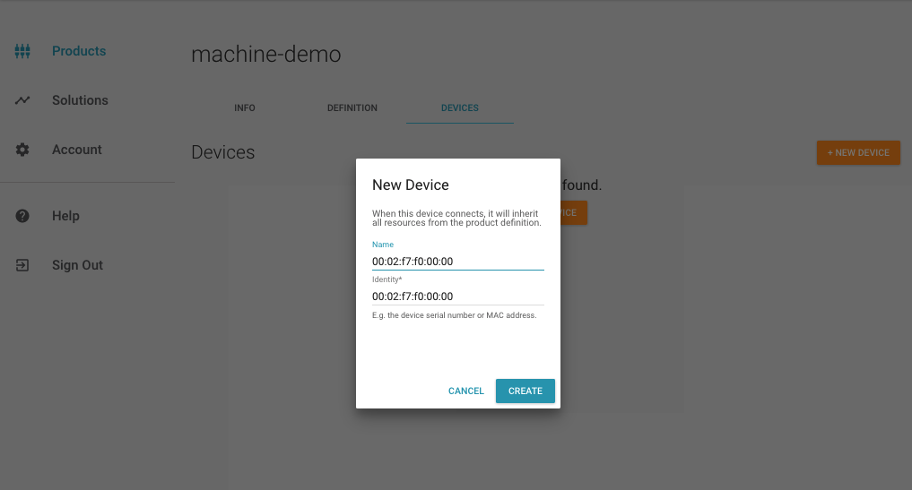

  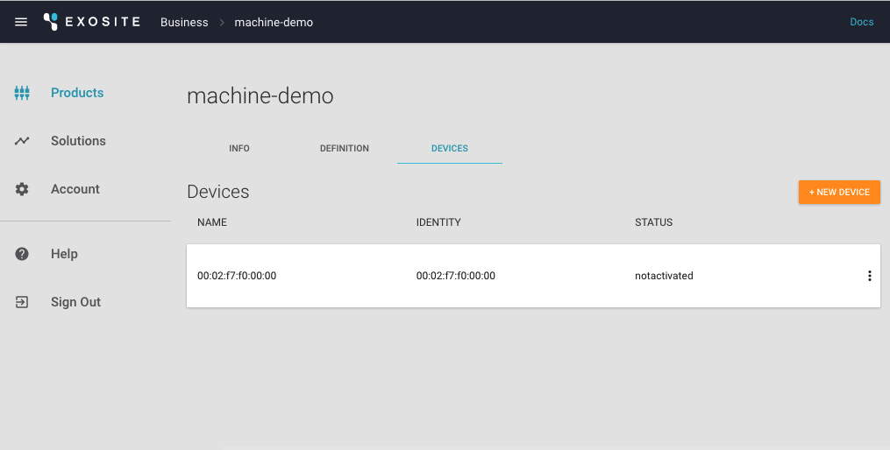

11. Your device should have a success provision activation call and retrieve it's CIK.  The status for the device should be 'activated' now in Murano product devices window.  Verify data is flowing by clicking on your device from the Devices tab.  You can use the product prototyping dashboard for your device to track temperature data, status, etc.

  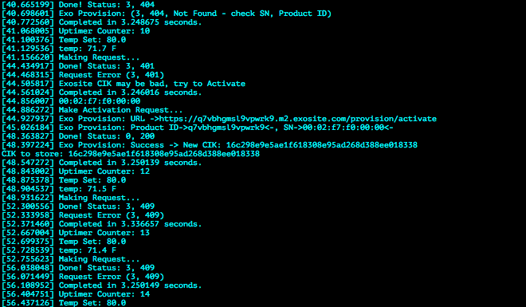

  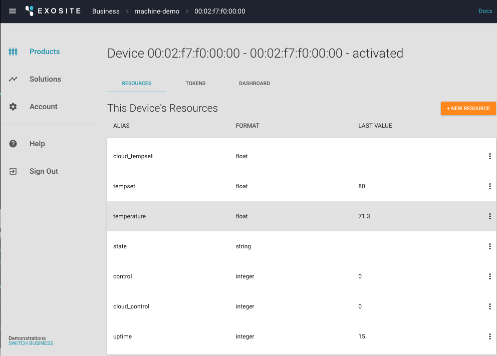

12. Now let's create a web app solution using a template Solution project.  Click on 'Solutions' in the left menu and then hit 'Create Solution'.  Give the solution a name and use the following template url as a template.
  * https://github.com/maanenson/exosite_machine_control_demo_stm32f_disco

  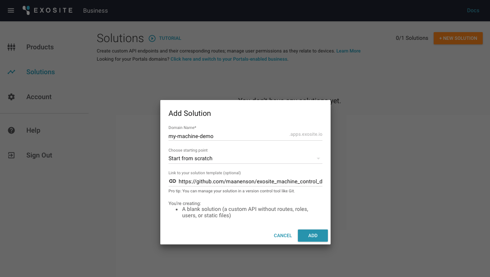

13.  Your new solution has hopefully been created from the template and you should see a screen like the following with your solution information and tabs to look at API Routes, Services, and other parts of the solution.

  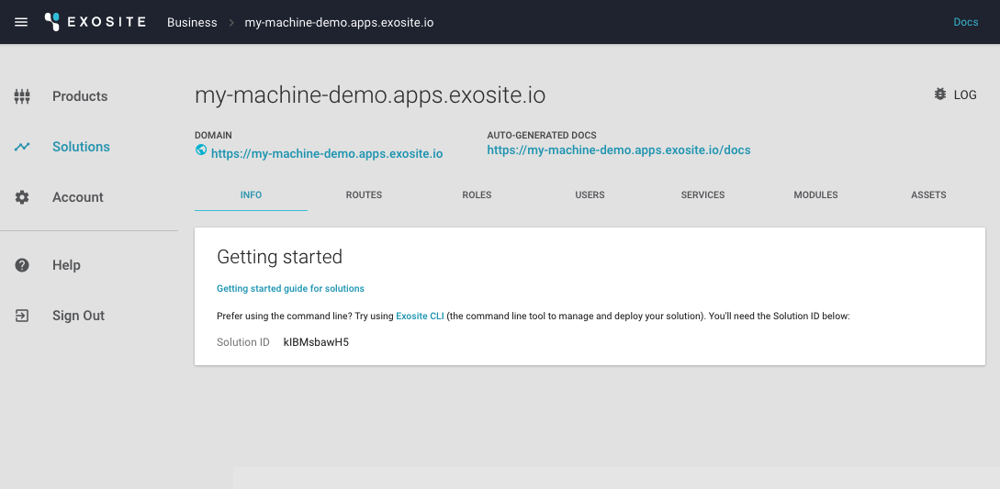

14. We need to enable your product (devices) events (read/write of data) to flow through to the Solution.  Click on the 'Services' tab, click on 'Products' and then click on the 'Gear' icon.  You should see your product listed here.  Click it and hit 'APPLY'.

  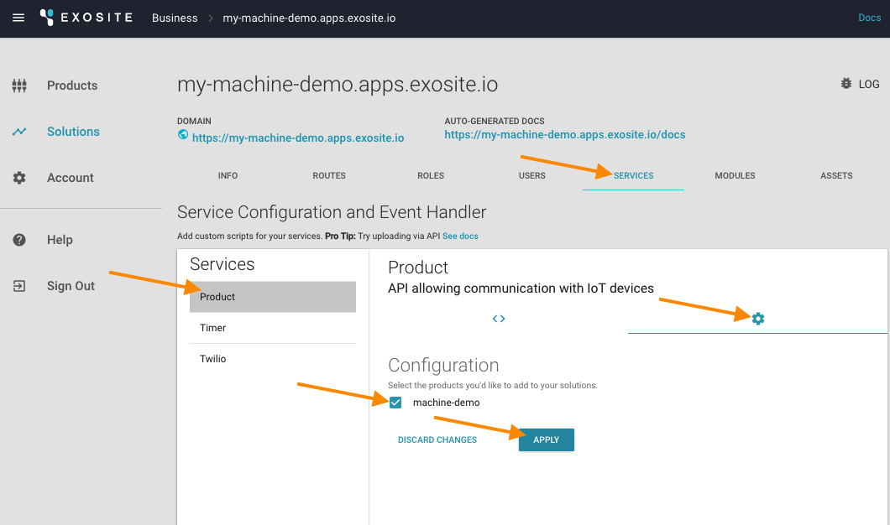

15. Let's go to your web application now.  Click on the link under 'DOMAIN' to bring you to the home page for the app.  

  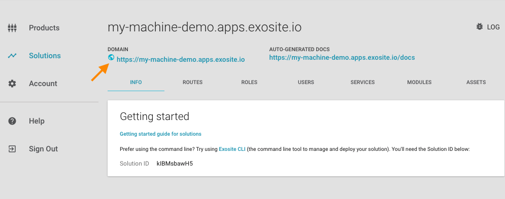

  

  

  *Note: The default device the single page app expects is '00:02:f7:f0:00:00', this is hard-coded in the script.js file for this solutions hosted assets.  On the web page, the device it is interacting with can be changed in the form on that page.  To change in the code, switch to using the Exosite Command Line tool and cloning this Solution project to your computer to deploy code updates.*

  * http://docs.exosite.com/murano/exosite-cli/

## Disclaimers:
This is a demo and meant to help get started on the Discovery dev kit.  It's a starting point and provided 'as is'.  There are many improvements that could be made to this guide and to the code.  Feel free to fork and make pull requests.  

This solution is a single page web app, it does not have a concept of users or log-ins.  
It is meant to demonstrate interacting with a remote device with Murano Solution APIs.

## Support
* General Exosite support should use https://support.exosite.com.
* Support for this specific demo can be sent to https://community.exosite.com.
